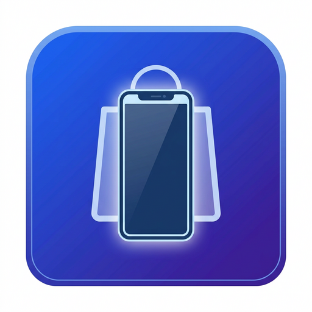

<p align="center">
  
</p>

<h1 align="center">📱 MOBPOS — نظام إدارة محلات الموبايلات المتكامل</h1>

<p align="center">
  <b>النظام الأول في مصر والوطن العربي المتخصص 100% في إدارة محلات الموبايلات والإكسسوارات والصيانة</b><br/>
  <sub>من نقطة البيع حتى آخر تقرير — كل حاجة في مكان واحد</sub>
</p>

<p align="center">
  
  
  
  
  
  
  
</p>

<p align="center">
  <a href="#-المميزات-الرئيسية">المميزات</a> •
  <a href="#-وحدات-النظام">الوحدات</a> •
  <a href="#-التقنيات-المستخدمة">التقنيات</a> •
  <a href="#-التثبيت-والتشغيل">التثبيت</a> •
  <a href="#-خطط-الترخيص">الترخيص</a> •
  <a href="BUILD_EXE.md">بناء EXE</a>
</p>

---

## 🎯 نظرة عامة

**MOBPOS** هو نظام إدارة متكامل صُمم خصيصاً لـ **محلات الموبايلات والإكسسوارات وخدمات الصيانة**. يغطي النظام كل جانب من جوانب العمل اليومي — من لحظة دخول المنتج للمخزون وحتى بيعه وصيانته ومتابعة ضمانه، مروراً بالنقود والعملاء والموردين والتقارير.

> 💡 **النتيجة:** بدلاً من استخدام 5 برامج مختلفة (مبيعات + مخزون + محاسبة + صيانة + عملاء)، تحصل على **نظام واحد** مصمم لفهم طبيعة شغلك بالظبط.

---

## ✨ المميزات الرئيسية

### 🛒 نقطة بيع (POS) احترافية وسريعة
- واجهة بيع سريعة جداً مصممة للسرعة القصوى — ابحث بالاسم، الباركود، أو المسح الضوئي مباشرة
- **مسح الباركود الفوري** — وجّه قارئ الباركود للمنتج ويتضاف تلقائياً للسلة
- **اختيار سيريال IMEI** عند بيع جهاز — يتم ربطه تلقائياً بالعميل والفاتورة
- **خصومات** بنسبة مئوية أو مبلغ ثابت
- **طرق دفع متعددة:** نقدي / بطاقة / آجل (حساب العميل)
- **فواتير سريعة** مع طباعة فورية للإيصال الحراري
- **إيقاف الفاتورة (Park/Hold)** — احفظ سلة مؤقتاً وارجع لها لاحقاً
- **إضافة عميل جديد** مباشرة من شاشة البيع بدون الخروج
- **إضافة منتج جديد** سريع (Quick Add) من داخل نقطة البيع
- **اختصارات لوحة المفاتيح** للتصرف بسرعة
- **مؤثرات صوتية** عند الإضافة والمسح (يمكن تعطيلها)
- **حساب الباقي** تلقائياً عند الدفع النقدي
- **مضاعف الكمية** لبيع نفس المنتج لأكثر من عميل بسرعة
- **رسائل تنبيه (Toast)** عند كل عملية لتأكيد النجاح أو التحذير

### 📦 إدارة مخزون ذكية
- تتبع كل منتج باسمه، كوده، باركوده، سعر التكلفة، سعر البيع، والكمية
- **تنبيه نواقص المخزون** — ينبهك لما أي منتج يوصل للحد الأدنى
- **تصنيف المنتجات** (أجهزة / إكسسوارات / قطع غيار) مع إمكانية إضافة تصنيفات مخصصة
- **توليد باركود تلقائي** (ببادئة مصر 622) مع فحص صحة الرقم (checksum)
- **طباعة ملصقات باركود** جاهزة للصق على المنتجات (Code 128)
- **منتجات بالسيريال (IMEI)** ومنتجات بدون — النظام يتعامل مع الاثنين
- تتبع حالة كل قطعة: جديد / مستعمل / مُعاد تصنيعه

### 📱 إدارة IMEI متكاملة
- تتبع كل جهاز على حدة برقمه التسلسلي (IMEI1 + IMEI2)
- تسجيل **اللون، السعة، الرام، الحالة** لكل جهاز
- **تتبع الضمان** — يعرض لك حالة الضمان (ساري / قارب على الانتهاء / منتهي) لكل جهاز
- **سجل كامل** لكل جهاز: مين اشتراه، متى، في أي فاتورة، وهل دخل الصيانة
- فلترة متقدمة بالمنتج، الحالة، اللون، حالة البيع
- **نقل ملكية الجهاز** بين الحالات (متاح → مباع → مرتجع → صيانة → هالك)
- **تنبيه الضمان** — ينبهك بالأجهزة اللي ضمانة شارف ينتهي خلال 30 يوم

### 🔧 نظام صيانة شامل
- **تذكرة صيانة** برقم تلقائي لكل جهاز يدخل الإصلاح
- تتبع حالة الجهاز: **مستلم → تحت الإصلاح → مكتمل → تم التسليم**
- تسجيل **قطع الغيار** المستخدمة من المخزون أو يدوياً مع حساب التكلفة تلقائياً
- حساب **الربح من كل صيانة** تلقائياً (سعر الصيانة - تكلفة القطع - مصروفات إضافية)
- **ربط الصيانة بـ IMEI** الجهاز إن وجد
- تعيين **الفني المسؤول** عن كل صيانة
- طباعة **إيصال استلام** للجهاز
- تتبع **عدد الأيام** من الاستلام لكل تذكرة
- **لوحة كانبان (Kanban Board)** لعرض كل التذاكر حسب حالتها

### 💰 الإدارة المالية والخزائن
- **خزائن متعددة** — خزنة رئيسية + خزنة إلكترونية (فودافون كاش/اتصالات كاش) + خزنة بنكية
- **تحويلات بين الخزائن** مع تسجيل تلقائي
- **عمليات المحافظ الإلكترونية** — إيداع وسحب مع حساب العمولة والربح
- **تسجيل الإيرادات والمصروفات** اليومية
- **حركات تلقائية** عند كل عملية بيع أو شراء أو صيانة
- **فلترة الحركات** حسب النوع والفترة الزمنية
- **رسوم بيانية** لحركة الأموال

### 📊 لوحة تحكم (Dashboard) تفاعلية
- **إحصائيات اليوم:** الإيرادات، الأرباح، عدد المبيعات
- **إحصائيات الشهر:** الإيرادات الشهرية، صافي الأرباح بعد المرتجعات والهالك
- **رصيد الخزائن الإجمالي** في لحظة
- **الأجهزة المتاحة والمباعة** بلمحة
- **الصيانة المعلقة والمكتملة**
- **تنبيه نواقص المخزون**
- **تنبيه الضمان** شارف على الانتهاء
- **مخطط بياني** لمبيعات آخر 7 أيام (إيرادات + أرباح)
- **مخطط دائري** للمبيعات حسب التصنيف
- **مخطط أعمدة** لحالة الصيانة

### 📋 تقارير احترافية
- **تقرير الإغلاق اليومي** — ملخص شامل لليوم: المبيعات، المرتجعات، المصروفات، حركات الخزائن، الأرصدة
- **تصدير Excel حقيقي (XLSX)** مع دعم كامل للعربية + تصدير CSV احتياطي
- **تقارير قابلة للطباعة / حفظ PDF** بتصميم احترافي
- تقارير المبيعات والأرباح
- تقارير المخزون والحركة
- تقارير المرتجعات والهالك

### 🔍 جرد المخزون (Inventory Audit)
- إنشاء **عمليات جرد** لمقارنة الفعلي بالنظامي
- حساب **العجز والزيادة** تلقائياً لكل صنف
- حساب **قيمة الفرق** بتكلفة الشراء
- **حفظ كمسودة** أو **تطبيق فوري** لتعديل الكميات
- **سجل الجردات السابقة** مع إمكانية الحذف
- **تصدير لـ Excel**

### 📒 الحسابات الجانبية (Side Accounts)
- نظام **دفتر حسابات خارجي** للتعاملات مع أشخاص وجهات خارجية
- **4 أنواع حركات:** ليّا عنده (مستحقات) / عليّا له (ديون) / فلوس داخلة / فلوس خارجة
- **5 أنواع تأثير:** بدون تأثير / الخزنة الرئيسية / رأس المال / خزنة مستقلة
- تتبع **حالة الدفع:** مفتوح / مدفوع جزئي / مقفل
- **تواريخ استحقاق** مع إمكانية التنبيه
- **إحصائيات:** إجمالي المستحقات، الديون، وصافي الفرق
- **تصدير Excel** لكل الحسابات

### 👥 إدارة العملاء
- بيانات كاملة (اسم، تليفون، عنوان)
- **رصيد الحساب** (آجل) يتحدث تلقائياً مع كل عملية بيع
- **تسجيل دفعات** من العميل وتخصم من الرصيد تلقائياً
- **إحصائيات العميل:** عدد المشتريات، الأجهزة المشتراة، إجمالي ما صرفه
- **كشف حساب العميل** تفصيلي (مبيعات + دفعات + مرتجعات)
- **البيع الآجل** مع تتبع المتبقي تلقائياً

### 🚚 إدارة الموردين
- بيانات الموردين (اسم، تليفون، عنوان)
- **تتبع الأرصدة** مع كل مورد
- **عمليات شراء** من الموردين مع تحديث المخزون تلقائياً
- **فواتير شراء آجلة** مع المتبقي

### 🗑️ إدارة الهالك (Stock Waste)
- تسجيل **المنتجات التالفة/الهالكة** مع سبب التلف
- ربط الهالك بالمورد لاسترداد التكلفة
- حساب **إجمالي تكلفة الهالك** وخصمه من الأرباح
- **تصدير تقرير** الهالك لـ Excel

### 🔄 المرتجعات (Sale Returns)
- **إرجاع منتجات** من فواتير سابقة
- حساب **قيمة الاسترداد** تلقائياً
- **إعادة المنتج للمخزون** عند الإرجاع
- **تسجيل السبب** لكل مرتجع
- **تحديث رصيد العميل** والخزنة تلقائياً
- تتبع **عدد المرتجعات** في التقارير

### 👤 إدارة الموظفين والصلاحيات
- **3 مستويات صلاحيات:** مدير النظام (Admin) / مشرف (Manager) / موظف (Staff)
- **الموظف:** يرى لوحة التحكم، نقطة البيع، الصيانة، والعملاء فقط
- **المشرف:** يرى كل شيء ما عدا الموظفين والإعدادات
- **مدير النظام:** صلاحيات كاملة على كل النظام
- **كلمات مرور مشفرة** (PBKDF2-HMAC-SHA-256 بملح عشوائي لكل مستخدم) مع ترقية تلقائية للحسابات القديمة
- **تغيير كلمة المرور** مع التحقق من القديمة
- عرض **جدول الصلاحيات** لكل دور

### 🌙 الوضع الليلي (Dark Mode)
- تبديل بين **الوضع الفاتح والداكن** بضغطة واحدة
- يحفظ الاختيار تلقائياً

### 🔔 نظام الإشعارات
- **تنبيه نواقص المخزون** (Low Stock)
- **تنبيه انتهاء الضمان** (Warranty Expiring)
- **تنبيه تأخر الصيانة** (Maintenance Delayed)
- **إشعارات معلوماتية** عامة
- قراءة/عدم قراءة مع إمكانية **تحديد الكل كمقروء**

---

## 💾 النسخ الاحتياطي والمزامنة

### 🗄️ نسخ احتياطي محلي تلقائي
- **نسخة احتياطية يومية** تلقائية (قابلة للتعطيل)
- حفظ **آخر 7 نسخ** احتياطية محلية (IndexedDB)
- **تصدير** النسخة كملف JSON
- **استيراد** نسخة احتياطية من ملف
- **استعادة** أي نسخة سابقة بضغطة واحدة

### ☁️ Google Drive Backup
- **ربط حساب Google Drive** عبر OAuth
- **رفع النسخة الاحتياطية** تلقائياً للسحابة
- **عرض النسخ** المحفوظة على Drive
- **استعادة** من أي نسخة على Drive
- **حذف** النسخ القديمة من Drive
- **Auto-Pruning** — يحتفظ بعدد محدود من النسخ على السحابة

### 🔄 المزامنة بين الأجهزة (Supabase Sync)
- **مزامنة فورية** بين جهاز الكاشير وجهاز المدير
- عبر **Supabase** — قاعدة بيانات سحابية مجانية
- **Push / Pull** — ارفع من جهاز وانزل على الثاني
- **أحدث نسخة تفوز** على مستوى كل مخزن بيانات
- **عزل أمني لكل متجر** عبر معرّف المتجر (`tenant_id`) وسياسات Row Level Security (RLS)
- **Schema جاهز** (SQL) في `supabase/schema.sql` لتطبيقه على Supabase لضمان عزل البيانات

---

## 🔐 نظام الترخيص (License System)

### لوحة تحكم المالك (Master Admin)
- **كلمة مرور رئيسية** مشفرة لإدارة المفاتيح
- **توليد مفاتيح ترخيص** موقعة رقمياً (ECDSA P-256)
- **تتبع المفاتيح** المصدرة وحالة كل واحد
- **مفتاح توقيع** يمكن استيراده أو توليده

### خطط الاشتراك

| الميزة | 🆓 أساسي (Basic) | 👑 احترافي (Pro) | 🏢 مؤسسي (Enterprise) | ♾️ دائم (Lifetime) |
|---|---|---|---|---|
| **عدد الموظفين** | 2 | 8 | 50 | 8 |
| **عدد المنتجات** | 50 | 500 | غير محدود | غير محدود |
| **عدد أجهزة IMEI** | 30 | 300 | غير محدود | غير محدود |
| **عدد العملاء** | 100 | 1,000 | غير محدود | غير محدود |
| **نقطة البيع (POS)** | ✅ | ✅ | ✅ | ✅ |
| **إدارة IMEI** | ❌ | ✅ | ✅ | ✅ |
| **قسم الصيانة** | ❌ | ✅ | ✅ | ✅ |
| **خزائن متعددة** | ❌ | ✅ | ✅ | ✅ |
| **الموردين** | ❌ | ✅ | ✅ | ✅ |
| **التقارير** | ❌ | ✅ | ✅ | ✅ |
| **النسخ الاحتياطي** | ❌ | ✅ | ✅ | ✅ |
| **الوضع الليلي** | ❌ | ✅ | ✅ | ✅ |
| **الحسابات الجانبية** | ✅ | ✅ | ✅ | ✅ |
| **جرد المخزون** | ✅ | ✅ | ✅ | ✅ |
| **السعر** | **مجاني** | **499 ج.م/شهر** | **999 ج.م/شهر** | **دفعة واحدة** |

### تفعيل الترخيص
- **مفتاح ترخيص موقع** يُدخل مرة واحدة على الجهاز
- **بصمة الجهاز** — كل مفتاح يعمل على جهاز واحد فقط
- **سيرفر تفعيل** (Activation Server) يتحقق من عدم تكرار المفتاح على أجهزة مختلفة
- **تنبيه انتهاء** مع صفحة تنبيه قبل انتهاء الاشتراك

---

## 🖥️ تطبيق سطح المكتب (Electron)

### مميزات النسخة المكتبية
- **ملف EXE** قابل للتوزيع والتثبيت على أي جهاز ويندوز
- **نسخة محمولة (Portable)** تشتغل من فلاشة USB بدون تثبيت
- **طباعة صامتة** — الإيصال يطبع مباشرة للطابعة بدون نافذة
- **وضع الكيوسك (Kiosk Mode)** — ملء الشاشة بدون إمكانية الخروج (`MOBPOS.exe --kiosk`)
- **تحديث تلقائي** عبر GitHub Releases — كل الأجهزة تحدث نفسها تلقائياً
- **سيرفر محلي** للنسخ الاحتياطي لجوجل درايف
- **حماية البيانات** — بيانات المحل محفوظة في `%APPDATA%\mobpos\` ومعزولة عن المتصفح
- **نسخة واحدة فقط** تعمل في أي وقت لمنع تعارض البيانات

### بناء ملف EXE
```bash
npm run dist:win          # Setup + Portable
npm run dist:win:portable # Portable فقط
```

> 📖 التفاصيل الكاملة في [BUILD_EXE.md](BUILD_EXE.md)

---

## 🛡️ الأمان

- 🔒 **كلمات مرور مجزأة بأمان** — PBKDF2-HMAC-SHA-256 بملح فريد لكل مستخدم، لا تُخزن كنص عادي أبداً، مع إجبار تغيير كلمة المرور الافتراضية عند أول دخول
- 🔑 **تغيير كلمة المرور** مع التحقق من القديمة
- 🖥️ **بصمة الجهاز** للترخيص — كل تفعيل على جهاز واحد
- 📝 **مفاتيح ترخيص موقعة** بتشفير ECDSA P-256
- 💾 **تخزين محلي** — البيانات على جهازك مش على سيرفر حد تاني
- 🔐 **فصل صلاحيات سيرفر التفعيل** — توكن إدارة إلزامي (`ADMIN_TOKEN`) يحمي عمليات الإلغاء والفك، وتوكن عميل اختياري
- 🛡️ **عزل المزامنة السحابية** — عزل بيانات كل متجر عبر (`tenant_id`) وسياسات RLS في Supabase

---

## 🚀 التقنيات المستخدمة

| التقنية | الاستخدام |
|---|---|
| **React 19** | إطار العمل الأساسي للواجهات |
| **TypeScript 5.9** | لغة البرمجة الأساسية |
| **Vite 8** | بناء وتشغيل المشروع |
| **Tailwind CSS 4** | تصميم الواجهات |
| **Lucide React** | أيقونات الواجهة (200+ أيقونة) |
| **Custom Store (useStore + Context)** | إدارة حالة التطبيق (نمط Zustand مخصص بدون تبعيات خارجية) |
| **IndexedDB** | قاعدة بيانات محلية في المتصفح (عملاء مخصصون بدون `idb`) |
| **Recharts** | الرسوم البيانية التفاعلية |
| **Electron 44** | تحويل التطبيق لبرنامج ويندوز |
| **electron-builder** | بناء ملف EXE + نسخة محمولة |
| **electron-updater** | التحديث التلقائي |
| **Supabase** | مزامنة البيانات بين الأجهزة (اختياري) |
| **Google Drive API** | نسخ احتياطي سحابي |
| **Express.js** | سيرفر التفعيل (Activation Server) |
| **uuid** | توليد معرفات فريدة |
| **Cairo Font** | خط عربي احترافي للواجهة والطباعة |

---

## 📦 التثبيت والتشغيل

### المتطلبات
- **Node.js 20+** (LTS)
- **npm** أو **yarn**

### خطوات التشغيل

```bash
# 1. استنساخ المشروع
git clone https://github.com/msharaf221/MOBPOS-V2.git
cd MOBPOS-V2

# 2. تثبيت الحزم
npm install

# 3. تشغيل خادم التطوير
npm run dev

# 4. البناء للإنتاج
npm run build

# 5. معاينة النسخة الإنتاجية
npm run preview
```

### تشغيل مع Electron (سطح المكتب)
```bash
# تشغيل في بيئة التطوير
npm run electron:dev

# بناء ملف EXE
npm run dist:win
```

---

## 📐 هيكل المشروع

```
MOBPOS/
├── src/
│   ├── components/         # مكونات الواجهة
│   │   ├── Dashboard.tsx       # لوحة التحكم والإحصائيات
│   │   ├── POS.tsx             # نقطة البيع
│   │   ├── Inventory.tsx       # إدارة المخزون
│   │   ├── InventoryAudit.tsx  # جرد المخزون
│   │   ├── IMEIManager.tsx     # إدارة أرقام IMEI
│   │   ├── MaintenanceBoard.tsx # لوحة الصيانة (Kanban)
│   │   ├── Customers.tsx       # إدارة العملاء
│   │   ├── Sales.tsx           # سجل المبيعات والمرتجعات
│   │   ├── Safes.tsx           # الخزائن والتحويلات
│   │   ├── Finance.tsx         # المالية والتقارير
│   │   ├── SideAccounts.tsx    # الحسابات الجانبية
│   │   ├── Suppliers.tsx       # الموردين
│   │   ├── Users.tsx           # الموظفين والصلاحيات
│   │   ├── Settings.tsx        # الإعدادات والنسخ الاحتياطي
│   │   ├── MasterAdmin.tsx     # لوحة تحكم مالك النظام
│   │   ├── LicenseActivation.tsx # تفعيل الترخيص
│   │   └── Login.tsx           # تسجيل الدخول
│   ├── hooks/
│   │   ├── useStore.ts         # المتجر الرئيسي (كل الوظائف)
│   │   ├── useIndexedDB.ts     # طبقة التخزين المحلي
│   │   └── useLocalStorage.ts  # تخزين محلي بسيط
│   ├── license/
│   │   ├── engine.ts           # محرك التحقق من الترخيص
│   │   ├── types.ts            # أنواع الخطط والميزات
│   │   ├── keys.ts             # المفاتيح العامة
│   │   ├── crypto.ts           # التشفير والتوقيع
│   │   └── device.ts           # بصمة الجهاز
│   ├── utils/
│   │   ├── reports.ts          # محرك التقارير (Excel + PDF)
│   │   ├── backup.ts           # محرك النسخ الاحتياطي
│   │   ├── sync.ts             # المزامنة عبر Supabase
│   │   ├── googleDrive.ts      # Google Drive API
│   │   ├── print.ts            # الطباعة (صامتة + عادية)
│   │   ├── barcode.ts          # توليد وطباعة الباركود
│   │   ├── audio.ts            # المؤثرات الصوتية
│   │   └── passwords.ts        # تشفير كلمات المرور
│   ├── types/
│   │   └── index.ts            # كل أنواع البيانات (TypeScript)
│   ├── data/
│   │   └── initialData.ts      # البيانات الابتدائية
│   ├── App.tsx                 # التطبيق الرئيسي
│   └── main.tsx                # نقطة الدخول
├── electron/
│   ├── main.cjs                # العملية الرئيسية لـ Electron
│   ├── preload.cjs             # جسر الأمان
│   └── local-server.cjs        # سيرفر محلي للنسخ الاحتياطي
├── activation-server/
│   ├── server.js               # سيرفر تفعيل الترخيص
│   └── README.md
├── supabase/
│   └── schema.sql              # مخطط قاعدة بيانات المزامنة
├── build/
│   ├── icon.ico                # أيقونة التطبيق (ويندوز)
│   └── icon.png                # أيقونة التطبيق
├── package.json
├── electron-builder.yml        # إعدادات بناء EXE
├── vite.config.ts
├── tsconfig.json
└── BUILD_EXE.md                # دليل بناء ملف EXE
```

---

## 🌍 دعم اللغات والعملات

- **اللغة:** عربي بالكامل (RTL) مع دعم الخط Cairo الاحترافي
- **العملات:** قابل للتخصيص بالكامل
  - جنيه مصري (EGP) — الافتراضي
  - ريال سعودي (SAR)
  - دولار أمريكي (USD)
  - أي عملة أخرى عبر الإعدادات

---

## ⌨️ اختصارات لوحة المفاتيح

نقطة البيع تدعم اختصارات لتسريع العمل:
- **F2** — إضافة عميل سريع
- **F3** — بحث سريع
- **F4** — إتمام البيع
- **Esc** — إلغاء / إغلاق النوافذ
- **Ctrl+H** — عرض الاختصارات

---

## 📸 لقطات الشاشة

> قريباً — سيتم إضافة صور توضيحية لكل وحدة من وحدات النظام

---

## 🔄 التحديث التلقائي (Auto-Update)

التطبيق المثبّت يفحص **GitHub Releases** تلقائياً:
- عند كل تشغيل
- كل 6 ساعات أثناء العمل
- يحمّل النسخة الجديدة ويُثبّتها عند إغلاق التطبيق

### لإصدار نسخة جديدة:
1. غيّر رقم الإصدار في `package.json`
2. ابنِ `npm run dist:win` (أو انشر تلقائياً بـ `npm run dist:win:publish`)
3. أنشئ GitHub Release وارفع ملفات `release/` (**يجب رفع `latest.yml` مع ملف الـ `.exe` ليعمل التحديث التلقائي**)
4. كل الأجهزة تحدث نفسها تلقائياً ✅

---

## 🤝 المساهمة

نرحب بالمساهمات! لأي تغييرات كبيرة:
1. افتح **Issue** لمناقشة الفكرة
2. اعمل Fork من المشروع
3. اعمل Branch للتغيير (`feature/اسم-الميزة`)
4. اعمل Pull Request

---

## 📄 الترخيص

هذا المشروع **مملوك (Proprietary)** — غير مرخص تحت MIT. الكود متاح للاطلاع، لكن الاستخدام التجاري يتطلب تفعيل ترخيص رسمي من خلال نظام الترخيص المدمج.

---

## 📞 التواصل والدعم

| القناة | الرابط |
|---|---|
| **GitHub** | [msharaf221/MOBPOS-V2](https://github.com/msharaf221/MOBPOS-V2) |
| **Issues** | [افتح تذكرة دعم](https://github.com/msharaf221/MOBPOS-V2/issues) |

---

## 🏆 ملخص سريع — ليه MOBPOS؟

| ❌ الحلول التقليدية | ✅ MOBPOS |
|---|---|
| برامج عامة مش مخصصة للموبايلات | مصمم 100% لمحلات الموبايلات |
| محتاج إنترنت دايماً | يشتغل أوفلاين بالكامل |
| بياناتك على سيرفر حد تاني | بياناتك على جهازك بس |
| معقد ويحتاج تدريب | بسيط وسهل التعلم |
| بتدفع شهري لكل مستخدم | خطة مدى الحياة متاحة |
| مش بيدعم IMEI والسيريالات | تتبع كل جهاز برقمه التسلسلي |
| مفيش قسم صيانة | نظام صيانة كامل بقطع الغيار والأرباح |
| تقارير محدودة | تقارير شاملة + تصدير Excel + PDF |
| نسخة واحدة بس | Web + Desktop + Portable + Kiosk |

---

<p align="center">
  <b>صُنع بـ ❤️ لتجار الموبايلات في مصر والوطن العربي</b><br/>
  <sub>MOBPOS — كل حاجة في مكان واحد</sub>
</p>
